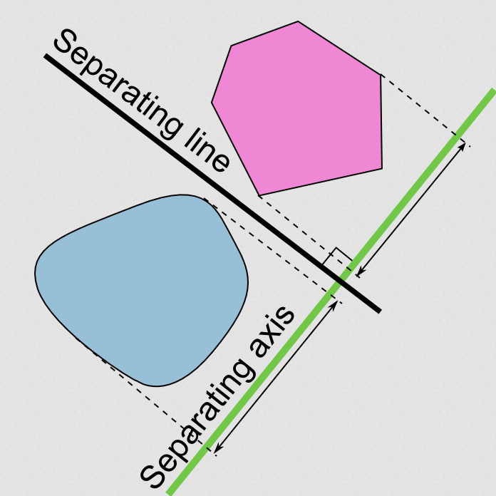
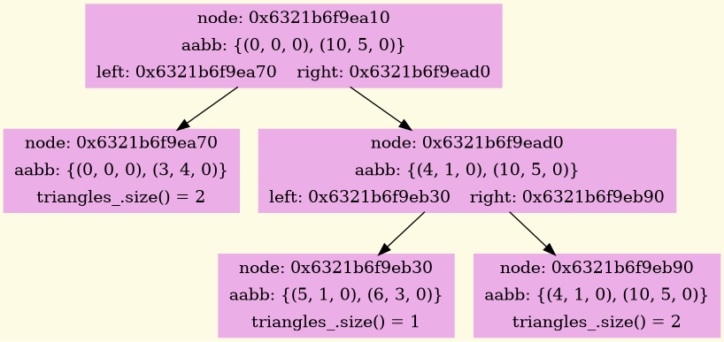

# Triangle Intersection Detection Project

A C++ project for efficiently detecting intersections between triangles in 3D space using BVH (Bounding Volume Hierarchy) and SAT (Separating Axis Theorem).

## Problem overview

Triangle-triangle intersection detection is a fundamental problem in computational geometry with applications in:
- Computer graphics (collision detection, ray tracing)
- Robotics (path planning, obstacle avoidance)
- CAD/CAM systems (solid modeling, mesh processing)
- Scientific computing (finite element analysis)

The naive approach of checking every triangle against every other triangle has O(n²) time complexity, which becomes prohibitively expensive for large meshes containing thousands or millions of triangles.

## Acceleration structure

A bounding volume hierarchy (BVH) is a tree structure on a set of geometric objects. All geometric objects, which form the leaf nodes of the tree, are wrapped in bounding volumes. These nodes are then grouped as small sets and enclosed within larger bounding volumes. These, in turn, are also grouped and enclosed within other larger bounding volumes in a recursive fashion, eventually resulting in a tree structure with a single bounding volume at the top of the tree. Bounding volume hierarchies are used to support several operations on sets of geometric objects efficiently, such as in collision detection and ray tracing. 

The tree allows to quickly discard large groups of objects that obviously do not intersect and check only potential candidates. In practice, BVH reduces the number of pairwise intersection tests from O(n²) to O(n log n) for well-distributed meshes, though worst-case scenarios may degrade performance.

<div align="center">

</div>

## Intersection detection algorithm

Let's consider three situations of the relative position of planes containing triangles.

#### 1. The planes are parallel
If the planes are parallel but not coincident, the triangles cannot intersect.

#### 2. The planes are coincident
Triangles can intersect if:

- at least one edge of the first triangle intersects with any edge of the second triangle;
- the first triangle is inside the second triangle or the second triangle is inside the first one.

In other cases, the triangles do not intersect.

#### 3. The planes intersect
We will check the intersection of triangles using the SAT (Separating Axis Theorem).

***SAT:***
Two convex geometries do not intersect if and only if there is a hyperplane between them that separates them. The axis orthogonal to the separating
hyperplane is called the separating axis, and the projections of the shapes on it do not intersect.

<div align="center">

</div>

***Property of the theorem:***
The potential separating axis will be in the following sets:

- normals to the edges of each of the objects;
- vector products of the edges of the first object on the edges of the second object.

In our case, it is necessary to check the intersections of the projections of the triangles on 11 dividing axes.: 2 normals and 9 pairwise vector products. If there is no intersection of projections on at least one axis, then the triangles do not intersect. Otherwise, the triangles intersect.

## Features

- High-performance intersection detection using BVH structure
- Detecting intersections between triangles using the separating axis theorem
- Comprehensive unit testing with Google Test framework
- Visualization of BVH tree using Graphviz

## Core Components

#### Geometry Primitives
- ```Point```: 3D point operations
- ```Vector```: 3D vector mathematics
- ```Segment```: Line segment representation
- ```Triangle```: Triangle geometry and properties

#### Acceleration Structure
- ```AABB```: Axis-Aligned Bounding Box for spatial partitioning
- ```Node```: Node in the BVH tree hierarchy
- ```BVH```: Main BVH class for building and querying the acceleration structure

## Installing and Running
```bash
git clone https://github.com/lavrt/Triangles_3D
cd Triangles_3D

cmake -B build -S . -DCMAKE_BUILD_TYPE=Release
cmake --build build

./build/triangles_3d    # running the main application

cd build && ctest       # running tests
```

## Visualization

The BVH implementation includes a graph visualization feature that generates DOT files for Graphviz.

<div align="center">

</div>

To convert the generated DOT files to PNG images:
1. Install Graphviz (if not already installed)
2. Run your program (the .gv files are generated automatically when you call Dump())
3. Convert to PNG using the dot command:
```bash
dot filename.gv -Tpng -o filename.png
```

## Requirements
- C++20 or later
- CMake 3.11+
- Google Test (for testing)
- Graphviz (optional, for visualization)
